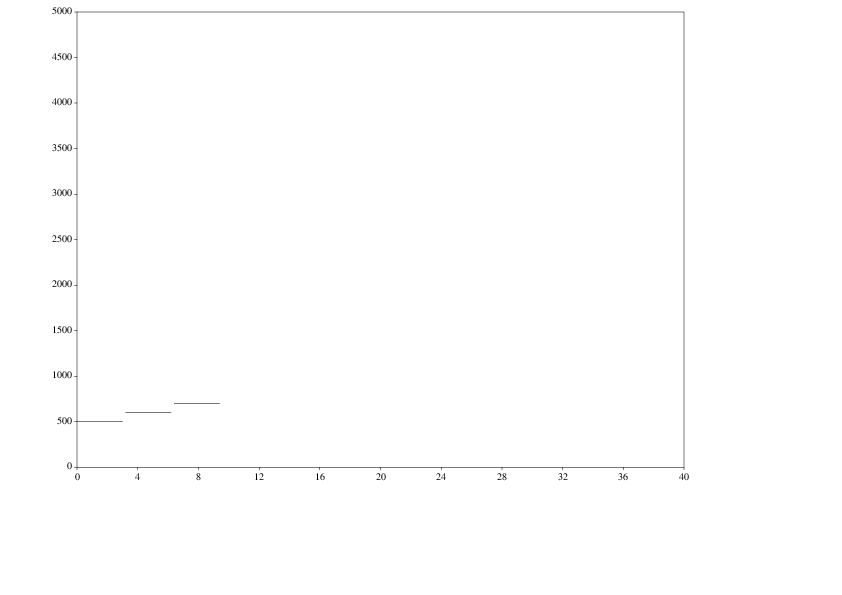

# Csgraph

[](https://gitter.im/nicb/csgraph?utm_source=badge&utm_medium=badge&utm_campaign=pr-badge&utm_content=badge)
[](https://travis-ci.org/nicb/csgraph)
[](https://codeclimate.com/github/nicb/csgraph)
[](https://codeclimate.com/github/nicb/csgraph/coverage)

A small ruby library and executable to create pic scripts suitable to be printed as graphics

## Installation

Add this line to your application's Gemfile:

```ruby
gem 'csgraph'
```

And then execute:

    $ bundle

Or install it yourself as:

    $ gem install csgraph

## Usage

Once installed, you can use `csgraph` as specified below.

If you have a `simple.csg` file like so:

```
instr 1 do
    line p2, p2+p3, p5, p5
end
```

and a `simple.sco` file like so:

```csound
i1 3.2 3 -8 600
i1 0 3 -8 500
i1 6.4 3 -8 700
```

then you can write on your terminal:

```
csgraph -f simple.csg simple.sco | groff -p -P-l -rN2 | ps2pdf - simple.pdf
```

`simple.pdf` will be something like:



This is a work in progress.
Please come back often for more info.
If you wish to help, check us out on
[Gitter!](https://gitter.im/nicb/csgraph?utm_source=badge&utm_medium=badge&utm_campaign=pr-badge&utm_content=badge)
You will be most welcome.

## Development

After checking out the repo, run `bin/setup` to install dependencies. Then, run `bin/console` for an interactive prompt that will allow you to experiment. Run `bundle exec csgraph` to use the code located in this directory, ignoring other installed copies of this gem.

To install this gem onto your local machine, run `bundle exec rake install`. To release a new version, update the version number in `version.rb`, and then run `bundle exec rake release` to create a git tag for the version, push git commits and tags, and push the `.gem` file to [rubygems.org](https://rubygems.org).

## Contributing

1. Fork it ( https://github.com/[my-github-username]/csgraph/fork )
2. Create your feature branch (`git checkout -b my-new-feature`)
3. Commit your changes (`git commit -am 'Add some feature'`)
4. Push to the branch (`git push origin my-new-feature`)
5. Create a new Pull Request
